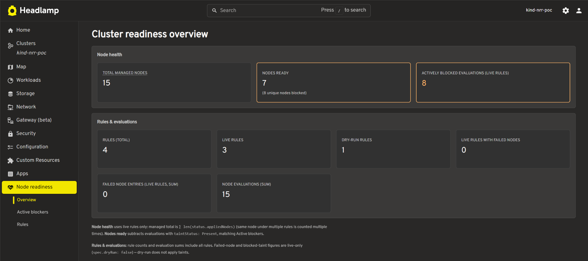
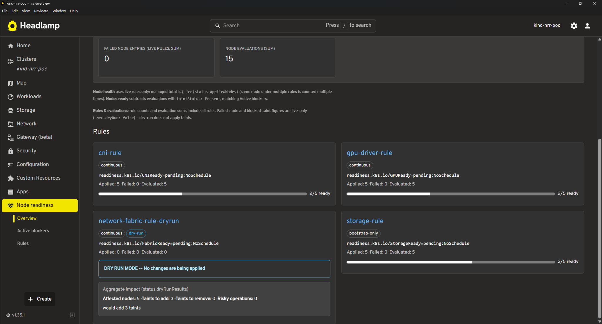
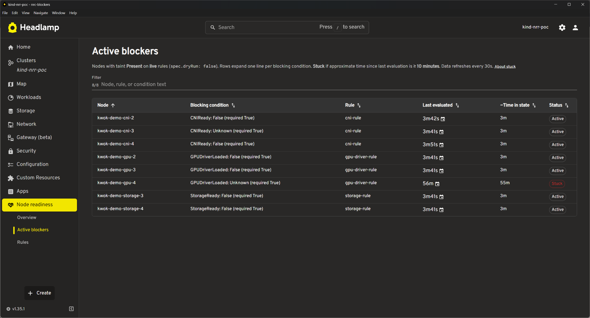
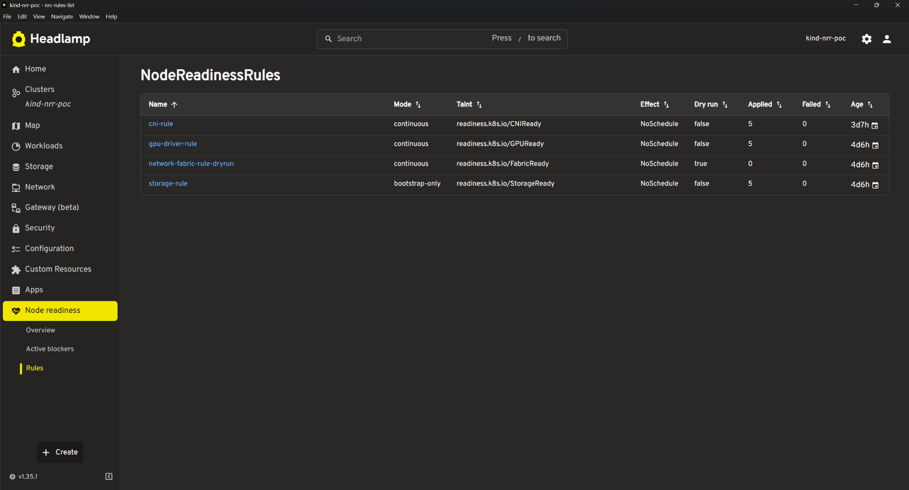
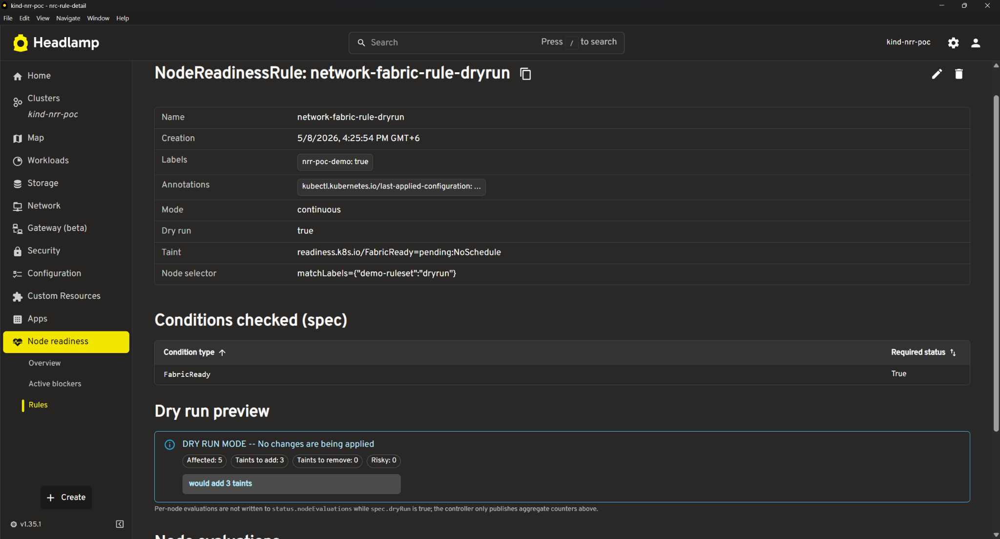

# Node Readiness Controller — Per-Rule Metrics and Headlamp Plugin
## LFX Mentorship PoC
This repository is my proof-of-concept fork of `node-readiness-controller` for the **CNCF LFX Mentorship 2026 Term 2** project:

> **Per-Rule Metrics and Headlamp Plugin for Node Readiness Controller**

The goal of this PoC was to improve **observability and usability** around Node Readiness Controller by adding:

- Per-rule Prometheus metrics inside the controller
- A Headlamp plugin for visualizing readiness state
- Grafana dashboards for SLO-style monitoring
- A reproducible local demo environment

This README focuses on **what I changed and where to look.**

---

# Quick Review Path

If you're reviewing this PoC and want the shortest path:

### Backend (metrics)

```text
internal/metrics/metrics.go
internal/controller/nodereadinessrule_controller.go
internal/controller/node_controller.go
```

### Frontend (Headlamp plugin)

```text
plugins/node-readiness-controller/
```

### Dashboard

```text
hack/dashboards/nrc-slo-dashboard.json
```

### Demo environment

```text
hack/dev-setup/
```

---

# Screenshots

### Cluster Overview




Cluster readiness summary showing managed nodes, blocked nodes, rule status, and readiness progress.

---

### Active Blockers



Real-time blocker table showing which rules and conditions are preventing nodes from becoming ready.

---

### Rules



Rule overview with enforcement mode, taint settings, evaluation counts, and failure visibility.

---

### Rule Detail



Detailed rule inspection including conditions, dry-run impact preview, and controller errors.

---

# What I built

## 1. Extended Prometheus Metrics (Go)

The upstream controller already exposes some metrics.

This PoC extends it with **per-rule observability**, allowing operators to answer questions like:

- Which rules trigger most frequently?
- Which rules take the longest to evaluate?
- Which conditions fail most often?
- Are nodes blocked because of actual enforcement or dry-run?
- How long does bootstrap take?

### Main implementation files

| Purpose                                     | File                                                  |
| ------------------------------------------- | ----------------------------------------------------- |
| Metric definitions + registration           | `internal/metrics/metrics.go`                         |
| Rule reconcile + evaluation instrumentation | `internal/controller/nodereadinessrule_controller.go` |
| Node-level signals + bootstrap timing       | `internal/controller/node_controller.go`              |

### Added metric categories

- Evaluation latency per rule
- Condition pass/fail counters
- Taint operation metrics
- Bootstrap duration
- Reconcile timing
- Rule execution statistics

These metrics are what power the Grafana dashboard.

---

## 2. Headlamp Plugin (TypeScript / React)

Everything for the UI lives under:

```text
plugins/node-readiness-controller/
```

The plugin reads `NodeReadinessRule` resources directly from Kubernetes and exposes them through multiple views.

---

### Overview

Cluster-wide readiness summary.

Main file:

```text
src/components/ClusterReadinessOverview.tsx
```

Shows:

- Managed nodes
- Ready vs blocked
- Active rules
- Dry-run rules
- Rule progress

---

### Active Blockers

Main files:

```text
src/components/ActiveBlockers.tsx
src/activeBlockersRows.ts
```

Shows:

- Blocked nodes
- Failing conditions
- Responsible rule
- Time blocked
- Stuck state detection

---

### Rules List

Main file:

```text
src/components/RuleList.tsx
```

Shows:

- All rules
- Enforcement mode
- Evaluation counts
- Failed nodes

---

### Rule Detail

Main files:

```text
src/components/RuleDetail.tsx
src/components/rules/
```

Shows:

- Condition breakdown
- Node evaluation
- Dry-run impact
- Error inspection

---

### Supporting infrastructure

| Purpose                   | File                                                            |
| ------------------------- | --------------------------------------------------------------- |
| Plugin entry + routing    | `src/index.tsx`, `src/sidebarInstall.ts`, `src/pluginRoutes.ts` |
| Resource layer            | `src/types.ts`, `src/resources/nodeReadinessRule.ts`            |
| NRC availability handling | `src/hooks/useNodeReadinessAPI.ts`, `src/nrcInstallGate.ts`     |
| Error UI                  | `src/components/rules/ErrorPanel.tsx`                           |

The plugin also handles the case where NRC is not installed and shows a safe fallback state.

---

## 3. Grafana Dashboard

Dashboard:

```text
hack/dashboards/nrc-slo-dashboard.json
```

Built directly on top of the new metrics.

Panels include:

- Bootstrap latency
- Rule evaluation latency
- Failure trends
- Taint throughput
- Rule bottleneck ranking

Import instructions:

```text
hack/dashboards/README.md
```

---

# Run Locally

Full setup:

```text
hack/dev-setup/README.md
```

Recommended order:

```text
CRDs
→ Controller + Metrics
→ KWOK
→ Monitoring
→ Rules
→ Nodes
→ Condition patching
```

Generate demo data:

```bash
./hack/dev-setup/demo-data.sh
```

Build plugin:

```bash
cd plugins/node-readiness-controller

npm install
npm run build
npm run package
```

Deploy:

```bash
./deploy.sh
```

---

## What's different from upstream

The upstream `kubernetes-sigs/node-readiness-controller` repo doesn't have a `plugins/` tree or any of the `hack/dev-setup/` demo infrastructure. Everything I added is clearly separated:

- `plugins/` — entirely new, not in upstream
- `hack/dashboards/` — entirely new
- `hack/dev-setup/` — extended with demo scripts, monitoring setup, KWOK node configs
- `internal/metrics/metrics.go` — extended with new metric definitions
- `internal/controller/nodereadinessrule_controller.go` — instrumented with metric updates
- `internal/controller/node_controller.go` — instrumented with node-level signals

The controller's reconciliation logic itself is unchanged. All changes are either additive (new metrics, new plugin) or observability instrumentation alongside existing code paths.

---

# Links

- Upstream repo: https://github.com/kubernetes-sigs/node-readiness-controller
- LFX project: https://mentorship.lfx.linuxfoundation.org/project/052329cb-9237-4950-90b2-78461302f8af
- Related issue: https://github.com/kubernetes-sigs/node-readiness-controller/issues/151
- Kubernetes Slack: https://kubernetes.slack.com/messages/sig-node-readiness-controller
